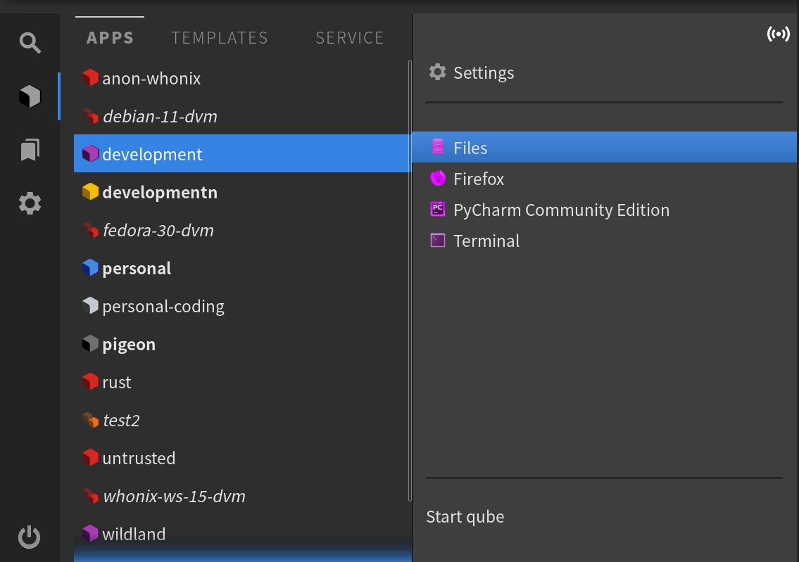
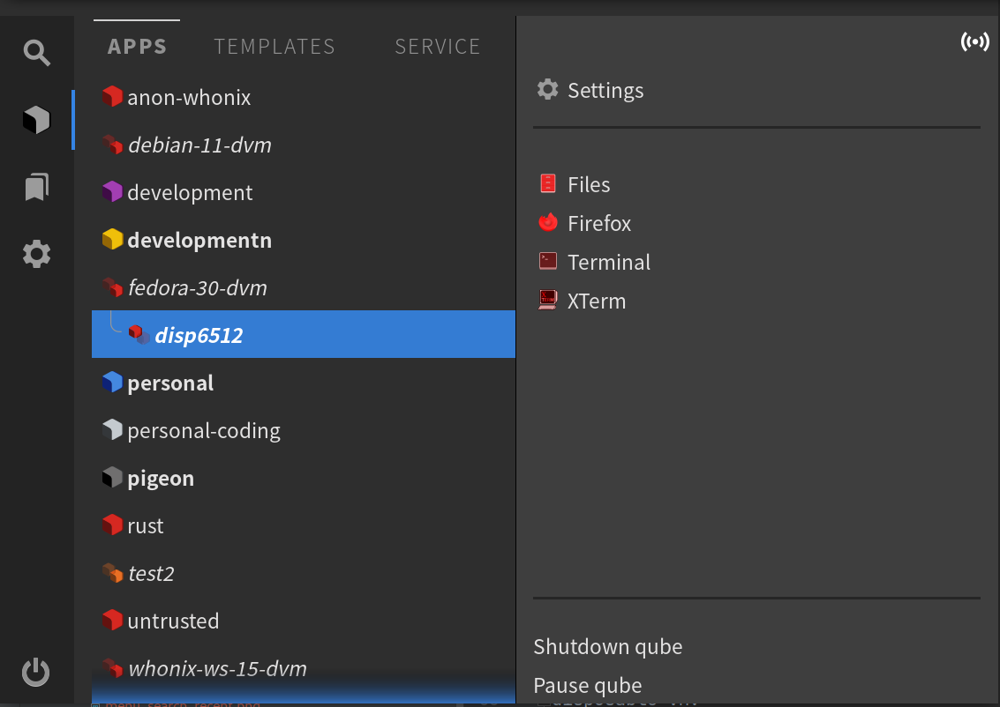
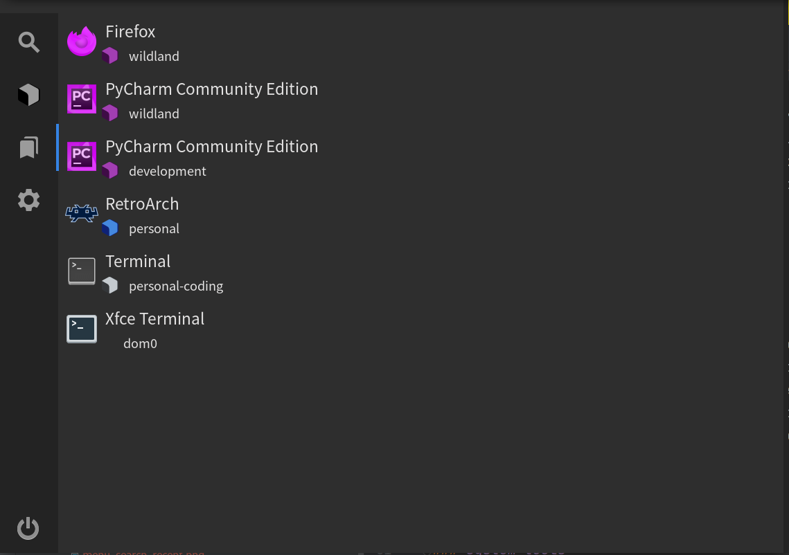
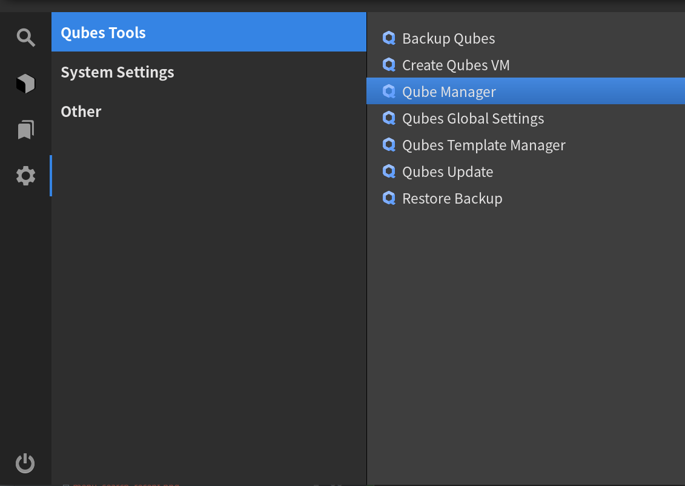
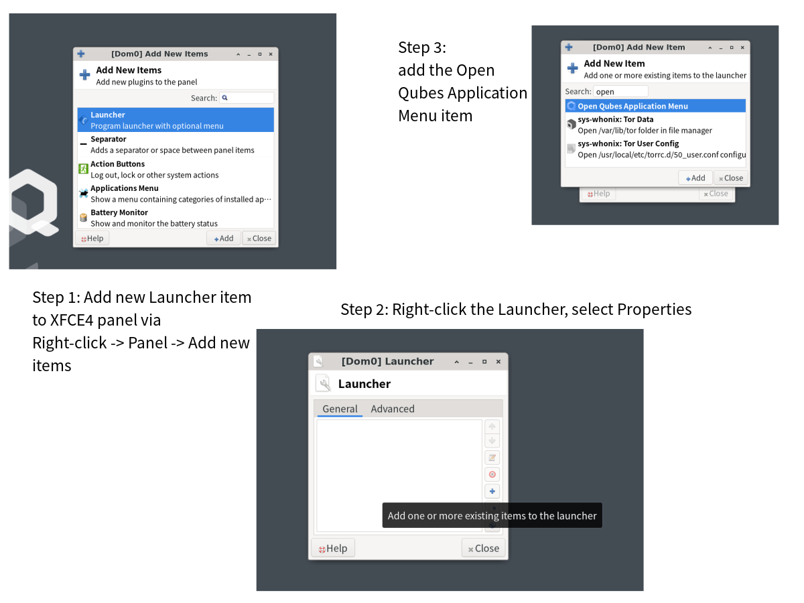

# Qubes Application Menu

This is the initial release of Qubes Application Menu. Certain functionalities
(especially related to integration with desktop managers) are yet in development,
but the basic functionality from initial release design is done.

## Features

The menu consists of three panes: Applications, Favorites and System Tools.

### Applications pane

The Application pane contains a list of all qubes found in user's system,
sorted into App qubes (with no special role), Templates (both "normal"
templates and Disposable VM templates) and Service qubes (such as `sys-usb` 
or `sys-net`). Running qubes' names are bolded.

Each qube, when selected, displays the list of all applications it exposes
(which can be set in the typical way, through Qube Settings, which are also
available through a convenient shortcut in the menu), and convenience options
to start/stop/pause qube.

In the top right corner of the Application pane the user can also see if the 
selected VM is networked or not. 

Disposable qubes work in a slightly different way: if an application is started
from the Apps section from a Disposable VM Template (denoted by icon and
italicized name), the application will start in a new disposable VM that will
appear on the list underneath its parent Disposable VM Template. Any further
apps can be also started in the same VM, exposing a functionality previously
unavailable through GUI means - that is, starting a program inside an existing
disposable VM.

### Favorites pane

All (except for those running in a disposable VM that will disappear on 
shutdown) applications in the main Applications pane and in the System 
Tools pane have a right-click menu with the option to "Add to favorites".
Applications added to favorites appear in the Favorites pane for quicker access.
They can also be removed from favorites from within the Favorites pane, also
through a right-click menu.

### System tools

All applications that can be run inside the current VM (`dom0` or a GUI domain)
are located in the System Tools pane; they are divided into categories of 
Qubes Tools (programs specific to Qubes), System Settings (various programs
related to system appearance etc.) and Other (Miscellanous programs found
in the system).

## How to run

The menu can be started via CLI: `qubes-app-menu`. The menu remains running
in the background until killed or restarted, to facilitate faster showing.

Useful CLI options are:
- `--restart` - restart the running menu instance
- `--keep-visible` - do not hide menu after actions
- `--page N` - select page to be shown when started (with 0 standing for main
application page, 1 being Favorites page and 2 being System Tools page.

The easiest way to use the menu is adding a Launcher item to XFCE4's panel that
contains the Open Qubes Application Menu item. It's a fast and efficient 
method, however, it will use the CLI params as set by either autostart menu 
position or via executing `qubes-app-menu` with desired params in CLI.

## Technical details

### New features

The menu uses one VM feature, named `menu-favorites` to store any VM favorites
selected by user in a persistent way. The item format is analogous to the one
used by `menu-items` feature, with one exception: items can be prefixed with
`@disp:`, which indicated they should be executed in a new disposable VM 
based on the one, on which the feature is set.

## Future plans

- discuss using existing .menu files for categorization of local
programs (that is, programs run in the VM that is running the menu)
- add placeholder entries for "missing" favorites entries (entries that 
are listed in appropriate VM feature, but do not currently have generated
corresponding .desktop files)
- color right pane with the color of currently selected VM; change the hover
color to the color of currently selected VM
- improve performance if menu is run as an executable
- discuss adding set Terminal and Files positions to every VM
- improve and extend right-click menus - some ideas are adding the contents
of current domains widget to menus for VMs, more information when an Add to 
favorites option is not present
- expose more menu options in the menu itself, such as --keep-visible
- add search functionality
- when search is added, add more keyboard shortcuts such as start/stop VM
- add "Restart VM" control item
- add a resize grabber
- discuss handling resizing and moving menu in a more complex way

